
 

# Graf Teorisi tabanlı Sosyal Ağ Analizi Uygulaması

| **Kategori** | **Detaylar** |
| --- | --- |
| **Üniversite** | Kocaeli Üniversitesi |
| **Fakülte / Bölüm** | Teknoloji Fakültesi / Bilişim Sistemleri Mühendisliği |
| **Ders Adı** | Yazılım Laboratuvarı I - Proje II |
| **Proje Konusu** | Sosyal Ağ Analizi ve Graf Görselleştirme Aracı |
| **Programlama Dili** | C# (.NET Framework / Windows Forms) |
| **Teslim Tarihi** | Aralık 2025 |

## Proje Ekibi (Geliştiriciler)

| Öğrenci Adı Soyadı | Öğrenci Numarası | GitHub |
| --- | --- | --- |
| **İrem Karayel** | 231307101 | [@iremkryl](https://github.com/iremkryl) |
| **Melike Sarı** | 231307102 | [@MelikeSarii](https://github.com/MelikeSarii) |

## Proje Tanımı ve Amacı

Bu proje, **Kocaeli Üniversitesi Teknoloji Fakültesi** bünyesinde verilen ders kapsamında, graf teorisi algoritmalarını ve sosyal ağ analizi yöntemlerini uygulamalı olarak göstermek amacıyla geliştirilmiştir. 

Proje, kullanıcılar arasındaki ilişkileri bir graf yapısı olarak modelleyen ve çeşitli graf algoritmalarını uygulayarak sosyal ağ üzerindeki bağlantıları analiz eden bir **Sosyal Ağ Analizi Uygulaması** geliştirilmesini amaçlamaktadır. Bu kapsamda geliştirilen sistem ile kullanıcılar:
* Kullanıcılar ve bağlantılardan oluşan ağı dinamik olarak yönetebilecek,
* En kısa yolları, toplulukları ve etkili kullanıcıları görselleştirebilecek,
* Grafı farklı algoritmalarla (örn: Welsh-Powell) renklendirebileceklerdir.

Proje teknik çıktıların yanı sıra; **nesne yönelimli programlama (OOP)**, **veri yapıları**, **algoritma analizi**, **görselleştirme** ve **yazılım tasarımı** becerilerini bütünleştirici biçimde ölçmeyi ve geliştirmeyi hedeflemektedir.

---

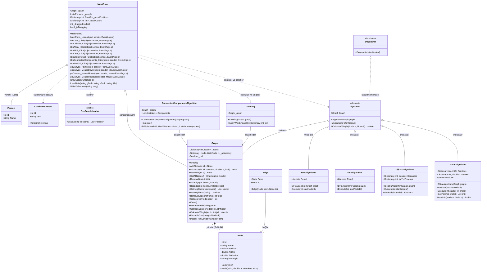
---

## 1. Amaç ve Kapsam

Bu teknik dokümantasyon, **Graf Teorisi tabanlı Sosyal Ağ Analizi Uygulaması**'nın mimari iskeletini, algoritmik temellerini ve sistem davranışlarını tanımlamak üzere oluşturulmuştur. Rapor, sadece kodun nasıl çalıştığını değil, **neden** bu tasarım kararlarının alındığını da mühendislik perspektifiyle açıklamayı hedefler.

Doküman boyunca aşağıdaki kritik başlıklar ele alınacaktır:

* **Mimari Bütünlük:** Sınıfların sorumluluk dağılımı ve SOLID prensiplerine uygunluğu.
* **Algoritmik Derinlik:** Kullanılan graf algoritmalarının matematiksel modelleri ve akış mantıkları.
* **Sistem Dinamiği:** Nesne yönelimli tasarımın (OOP) canlı sisteme yansıması ve veri akış süreçleri.

Bu kılavuz, sistemi geliştirecek veya inceleyecek teknik paydaşlar için bağlayıcı bir referans noktasıdır.

## 2. Genel Mimari Yaklaşım

Sistem, sürdürülebilirlik ve modülerlik esas alınarak, **Nesne Yönelimli Tasarım (OOP)** prensipleri üzerine inşa edilmiştir. Mimari kurgulanırken "Spagetti Kod" yapısından kaçınılmış, bunun yerine katmanlı ve sorumlulukları ayrıştırılmış bir yapı hedeflenmiştir.

Tasarım felsefesinin temel taşları şunlardır:

* **Gevşek Bağlılık (Loose Coupling):** Arayüz (UI) ve İş Mantığı (Business Logic) katmanları birbirinden izole edilmiştir.
* **Genişletilebilirlik (Extensibility):** Yeni bir algoritma eklemek, mevcut kodu değiştirmeyi gerektirmez (Open-Closed Prensibi).
* **Soyutlama (Abstraction):** Karmaşık algoritma mantıkları, ortak arayüzler arkasına gizlenerek yönetim kolaylığı sağlanmıştır.

Sistemin kalbinde, veriyi tutan ve yöneten **Graph** sınıfı bulunur; algoritmalar ise bu veriyi işleyen "ziyaretçiler" gibi davranır.

## 3. Temel Sınıflar ve Sorumlulukları

Sistemin omurgasını oluşturan sınıflar, "Tek Sorumluluk Prensibi" (Single Responsibility Principle) gözetilerek tasarlanmıştır.

### 3.1 Node

**Node**, sosyal ağın en küçük yapı taşıdır; sistemdeki her bir "Kullanıcı" veya "Aktör" bu sınıf ile temsil edilir.

**Kritik Sorumluluklar:**

* **Kimlik Yönetimi:** Benzersiz ID ve isim bilgilerini saklar.
* **Öznitelik Taşıma:** Algoritmaların karar mekanizmalarını etkileyen "Aktiflik", "Etkileşim" ve "Bağlantı Derecesi" gibi sayısal verileri barındırır.
* **Görsel Temsil:** Grafiğin çizimi için gerekli koordinat (X, Y) verilerini yönetir.

**Tasarım Notu:** Node sınıfı "aptal nesne" (dumb object) prensibine yakındır; iş mantığı içermez, sadece veri taşır.

### 3.2 Edge

**Edge**, iki Node arasındaki anlamsal bağı ifade eder. Bu projede kenarlar **yönsüz (undirected)** olarak modellenmiş olup, sistemin en kritik parçası olan **dinamik ağırlık mekanizmasına** ev sahipliği yapar. Kenar ağırlığı sabit bir değer değil, bağladığı iki düğümün öznitelik farklarından türetilen hesaplanmış bir değerdir.

### 3.3 Graph

**Graph**, sistemin veritabanı ve orkestra şefidir. Tüm düğümlerin ve kenarların yaşam döngüsü burada yönetilir.

**Temel Görevler:**

* **Topoloji Yönetimi:** Düğüm ekleme/çıkarma ve komşuluk listelerinin (Adjacency List) güncel tutulması.
* **Veri Sağlayıcı:** Algoritmaların ihtiyaç duyduğu ham veriyi (örneğin; "X düğümünün komşuları kim?") servis eder.
* **Durum Kontrolü:** Grafın boş olup olmadığı veya belirli bir bağlantının varlığı gibi sorguları yanıtlar.

### 3.4 Algorithm (Abstract / Interface)

Tüm graf algoritmaları için bir "sözleşme" niteliği taşıyan soyut yapıdır. BFS, DFS, Dijkstra gibi tüm türevler bu sınıftan miras alır.

Bu yapı sayesinde ana program, hangi algoritmanın çalıştığını bilmek zorunda kalmaz; sadece `Execute()` komutunu gönderir (Polimorfizm). Bu, sisteme gelecekte eklenecek yeni algoritmalar için "tak-çıkar" esnekliği sağlar.

### 3.5 Sistem İş Akışı (Sequence Diagram)

Aşağıdaki diyagram, bir kullanıcının algoritma çalıştırdığında sistemin arka planda (UI -> Algoritma -> Graph) nasıl haberleştiğini özetlemektedir:

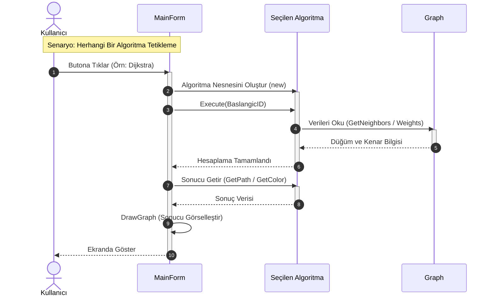

# 4. Algoritmalar

Bu bölümde, projenin beynini oluşturan algoritmalar incelenmiştir. Her bir algoritma, sadece teorik tanımıyla değil, projedeki **spesifik kullanım amacı** ve **uygulama detayıyla** ele alınmıştır.

---

## 4.1 Breadth-First Search (BFS)

### 4.1.1 Algoritmanın Amacı

Genişlik Öncelikli Arama (BFS), grafı bir taşın suya atıldığında oluşan dalgalar gibi, merkezden dışa doğru **katman katman** tarayan stratejik bir algoritmadır. Projemizde bu algoritma, "Benimle 3. dereceden bağlantılı kişiler kimler?" sorusuna yanıt arayan **Erişilebilirlik Analizleri** ve **En Kısa Yol (Kenar bazlı)** problemlerinde başrol oynamaktadır.

---

### 4.1.2 Çalışma Mantığı

BFS, "Önce giren önce çıkar" (FIFO) mantığıyla çalışan bir **Kuyruk (Queue)** mimarisi üzerine kuruludur. Bu, algoritmanın bir düğümden çok uzaklaşmadan önce, o düğüme yakın olan tüm komşuları keşfetmesini garanti eder.

İşleyiş adımları şu disiplinle ilerler:

1. Başlangıç noktası kuyruğa atılır ve "Görüldü" olarak işaretlenir.
2. Kuyruktan bir düğüm çekilir.
3. O düğümün henüz keşfedilmemiş tüm doğrudan komşuları kuyruğa eklenir.
4. Kuyruk tamamen boşalana kadar (tüm erişilebilir ağ taranana kadar) döngü sürer.

---

### 4.1.3 Akış Diyagramı (Flowchart)

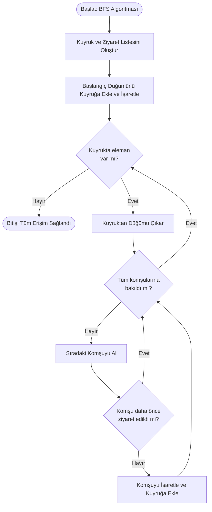
---

### 4.1.4 Zaman ve Uzay Karmaşıklığı

* **Zaman Karmaşıklığı:** `O(V + E)` — Algoritma her düğüme ve her kenara en fazla bir kez dokunur.
* **Uzay Karmaşıklığı:** `O(V)` — En kötü senaryoda tüm düğümler kuyrukta tutulabilir.
*(V: Düğüm Sayısı, E: Kenar Sayısı)*

### 4.1.5 Literatür İncelemesi

## 1) BFS (Breadth-First Search) – Genişlik Öncelikli Arama

**Köken ve literatür bağlamı:**
BFS, graf üzerinde **katman katman** (başlangıç düğümüne olan mesafe artacak şekilde) dolaşan temel bir gezinme yöntemidir. Literatürde BFS’nin en önemli sonucu, **ağırlıksız graf** veya tüm kenar ağırlıkları eşit kabul edilen problemlerde **en kısa yolu** (en az kenar sayısı) garanti etmesidir. BFS’nin erken dönemde “labirentte en kısa çıkış yolu” problemi üzerinden yayımlanması, algoritmanın pratik problemlere (robotik, yönlendirme, routing vb.) hızlı adapte olmasını sağlamıştır. ([Jeff Erickson][1])

**Temel fikir:**

* Bir **kuyruk (queue)** kullanılır.
* Önce başlangıca 1 adım uzak düğümler, sonra 2 adım uzak düğümler… şeklinde ilerlenir.
* Bu katmanlı ilerleme BFS’yi, ağırlıksız graf üzerinde “en kısa yol” için doğal çözüm yapar.
  
**Uygulamalar:**

* Ağırlıksız en kısa yol, seviye (level) hesaplama
* **Bağlı bileşen** bulma (undirected graf)
* Sosyal ağlarda yakınlık/mesafe analizleri, oyunlarda grid pathfinding’in temel hali

---

## 2) DFS (Depth-First Search) – Derinlik Öncelikli Arama

**Köken ve literatür bağlamı:**
DFS, grafı “mümkün olduğunca derine inerek” dolaşır. DFS fikri çok erken dönemlerden beri bilinse de, DFS’nin modern algoritma literatüründeki gücü; **lineer zamanlı** (O(V+E)) birçok kritik problemin (ör. güçlü bağlı bileşenler, biconnected yapılar vb.) temel yapı taşı olmasıyla öne çıkmıştır. Bu bağlamda Tarjan’ın DFS tabanlı lineer algoritmaları, DFS’nin teorik önemini iyice pekiştirmiştir. ([epubs.siam.org][3])

**Temel fikir:**

* **Stack** (ya da recursion) mantığıyla çalışır.
* Bir düğüme gidilir, oradan komşularına gidilir, tıkanınca geri dönülür (backtracking).
* DFS ağacı/ormanı ve keşif zamanları gibi kavramlar ileri analizlerde kullanılır.

**Uygulamalar:**

* Topolojik sıralama (DAG)
* Döngü tespiti
* (Directed graph) güçlü bağlı bileşenler (SCC) için temel yaklaşım
* Bağlı bileşen / erişilebilirlik analizi

---

## 3) Bağlı Bileşen (Connected Components)

**Literatür bağlamı ve tanım:**
Bir grafın **bağlı bileşenleri**, (özellikle **undirected** graf için) birbirine yol ile ulaşılabilen düğüm kümeleridir. Bu problem, grafın “kaç parçadan oluştuğunu” bulmanın en temel yoludur ve büyük ölçekli ağ analizlerinde (sosyal ağ, iletişim ağı, modüler yapı incelemesi) sıkça başlangıç adımıdır.

**Temel yaklaşım:**

* Her ziyaret edilmemiş düğümden BFS veya DFS başlatılır.
* Her başlatma, **bir bağlı bileşeni** tamamen keşfeder.
* Kaç kez başlatıldıysa o kadar bileşen vardır.

**Not (Directed graf):**
Directed graf için “bağlılık” ikiye ayrılır:

* **Zayıf bağlılık (weakly connected):** yönleri yok sayıp bileşen bulma
* **Güçlü bağlılık (strongly connected):** her düğümden her düğüme yönlü yol olmalı (SCC). SCC için DFS tabanlı Tarjan/Kosaraju gibi algoritmalar literatürde standarttır. ([epubs.siam.org][3])

---

## 4) Dijkstra – En Kısa Yol (Ağırlıklı, Negatif Olmayan)

**Köken ve literatür bağlamı:**
Dijkstra algoritması, ağırlıkları **negatif olmayan** (≥0) graflarda tek kaynaktan en kısa yolları bulan klasik yöntemdir. Dijkstra’nın 1959 tarihli çalışması, modern en kısa yol literatürünün temel taşlarındandır ve sonraki pek çok optimizasyonun (ör. priority queue, Fibonacci heap vb.) çıkış noktası olmuştur. ([CWI][5])

**Temel fikir:**

* “Şu ana kadar bulunan en kısa” mesafeyi kesinleştirerek büyüyen bir küme oluşturur.
* Her adımda, geçici mesafesi en küçük olan düğüm seçilir ve komşular **relaxation** ile güncellenir.
* Öncelik kuyruğu (min-heap) kullanımı pratikte standarda dönüşmüştür.

**Doğruluk şartı:**

* Kenar ağırlıkları **negatif olmamalı**. Negatif ağırlık varsa Bellman–Ford gibi yöntemler gerekir.

**Uygulamalar:**

* Yol bulma (harita), ağ yönlendirme, lojistik planlama
* A* için temel “g(n)” alt yapısı (A* aslında Dijkstra’nın heuristik eklenmiş hali gibi düşünülebilir)

---

## 5) A* (A-Star) – Heuristik En Kısa Yol Araması

**Köken ve literatür bağlamı:**
A* algoritması, Hart–Nilsson–Raphael (1968) tarafından formel temele oturtulmuştur. A*’ın ana fikri, en kısa yolu ararken sadece “şimdiye kadarki maliyet”i değil, hedefe kalan “tahmini maliyet”i de hesaba katarak aramayı yönlendirmektir. Bu sayede doğru heuristik ile Dijkstra’ya göre çok daha az düğüm genişletip aynı optimal sonuca ulaşabilir. ([Stanford Yapay Zeka Laboratuvarı][6])

**Temel fikir (f(n)=g(n)+h(n)):**

* **g(n):** başlangıçtan n’ye gerçek maliyet
* **h(n):** n’den hedefe tahmini maliyet (heuristic)
* **f(n):** genişletme önceliği

**Optimalite koşulları:**

* Eğer h(n) **admissible** (asla gerçek en kısa kalan maliyeti aşmayan) ise A* **optimal** çözüm verir.
* h(n) ayrıca **consistent/monotone** olursa (pratikte sık istenir) tekrar açma sayısı azalır, implementasyon sadeleşir.

**Uygulamalar:**

* Oyunlarda pathfinding (grid haritalar), robotik, navigasyon
* Harita/rota motorları (heuristik çoğu zaman “kuş uçuşu mesafe” benzeri)

---

## 6) Welsh–Powell – Graf Boyama İçin Açgözlü Heuristik

**Köken ve literatür bağlamı:**
Welsh–Powell (1967), graf boyama problemine (chromatic number) pratik bir **üst sınır** veren, derecelere dayalı **greedy** bir yaklaşım sunar. Graf boyama NP-zor olduğundan, Welsh–Powell gibi heuristikler özellikle zaman çizelgeleme (timetabling), kaynak atama ve çakışma problemlerinde yaygın şekilde kullanılır. ([OUP Academic][7])

**Temel fikir:**

1. Düğümleri dereceye göre azalan sırala.
2. Sırayla gez: aynı renge boyanabilecek (aralarında kenar olmayan) düğümleri aynı renge boya.
3. Boyanamayanlar için yeni renk aç.

**Özellikler:**

* **Optimal** renk sayısı garanti edilmez; amaç hızlı, makul çözüm üretmektir.
* Sıralama stratejisi (dereceye göre) pratikte sonucu etkiler.

**Uygulamalar:**

* Ders programı / sınav programı, görev çizelgeleme
* Frekans atama, register allocation (derleyicilerde) gibi çatışma grafı problemleri
---

## 4.2 Depth-First Search (DFS)

### 4.2.1 Algoritmanın Amacı

Derinlik Öncelikli Arama (DFS), bir labirentte çıkış yolu arayan bir gezgin gibi davranır; bir yolu sonuna kadar takip eder, tıkanırsa geri döner (backtracking) ve yeni bir yol dener. Projemizde bu algoritma, grafın **yapısal bütünlüğünü analiz etmek**, **döngüleri tespit etmek** ve **bağlı bileşenleri ayrıştırmak** için kritik bir rol üstlenir.

---

### 4.2.2 Çalışma Mantığı

DFS, "Son giren ilk çıkar" (LIFO) prensibiyle çalışan bir **Yığın (Stack)** yapısı veya özyinelemeli (recursive) fonksiyon çağrıları ile yönetilir. Bu, algoritmanın yatayda genişlemek yerine, dikeyde derinleşmesini sağlar.

---

### 4.2.3 Akış Diyagramı (Flowchart)

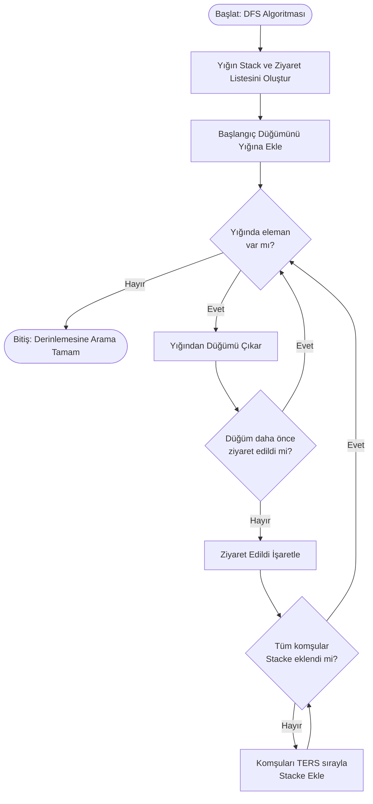
---

### 4.2.4 Zaman ve Uzay Karmaşıklığı

* **Zaman Karmaşıklığı:** `O(V + E)`
* **Uzay Karmaşıklığı:** `O(V)` — Derinliğe bağlı olarak yığın boyutu artabilir.

---

### 4.2.5 Literatür İncelemesi

Akademik çalışmalarda DFS; topolojik sıralama, güçlü bağlı bileşenlerin (Strongly Connected Components) bulunması ve labirent çözme algoritmalarının temelini oluşturur.

---

## 4.3 Dijkstra Algoritması

### 4.3.1 Algoritmanın Amacı

Dijkstra, ağırlıklı grafların "Altın Standardı"dır. Bu algoritma, sistemimizde iki kullanıcı arasındaki **en verimli (en düşük maliyetli) ilişki zincirini** bulmak için kullanılır. Buradaki "maliyet", fiziksel mesafe değil; düğümlerin benzerliklerinden türetilen **dinamik ağırlıktır**.

---

### 4.3.2 Çalışma Mantığı

Dijkstra, "Açgözlü Yaklaşım" (Greedy Approach) prensibini benimser. Her adımda, o ana kadar keşfedilmiş en düşük maliyetli düğümü seçer ve bu düğüm üzerinden komşularına daha kısa bir yol olup olmadığını (Relaxation/Gevşetme) kontrol eder.

---

### 4.3.3 Akış Diyagramı (Flowchart)

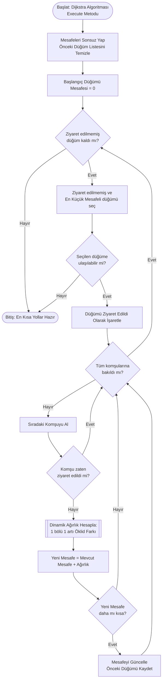
---

### 4.3.4 Zaman ve Uzay Karmaşıklığı

* **Zaman Karmaşıklığı:** `O((V + E) log V)` — Öncelikli kuyruk (Priority Queue) veya benzeri yapı kullanıldığında.
* **Uzay Karmaşıklığı:** `O(V)`

---

### 4.3.5 Literatür İncelemesi

1956'da Edsger W. Dijkstra tarafından geliştirilen bu yöntem, günümüzde OSPF gibi internet yönlendirme protokollerinden Google Maps'e kadar geniş bir yelpazede endüstri standardıdır.

---

## 4.4 A* (A-Star) Algoritması

### 4.4.1 Algoritmanın Amacı

A* (A-Star), Dijkstra'nın "akıllı" kardeşi olarak tanımlanabilir. Hedefe körü körüne gitmek yerine, bir pusula (Heuristic) kullanır. Projemizde, özellikle hedef düğümün belli olduğu durumlarda performansı optimize etmek için sisteme entegre edilmiştir.

---

### 4.4.2 Çalışma Mantığı

A*, karar verirken `f(n) = g(n) + h(n)` formülünü kullanır:

* **g(n):** Başlangıçtan buraya kadar harcanan gerçek maliyet (Dijkstra mantığı).
* **h(n):** Buradan hedefe kalan **tahmini** maliyet (Heuristic).

Bu projede heuristic fonksiyonu olarak **Öklidyen Uzaklık** kullanılmıştır; bu sayede algoritma, hedeften uzaklaşan yolları keşfetmekle vakit kaybetmez.

---

### 4.4.3 Akış Diyagramı (Flowchart)

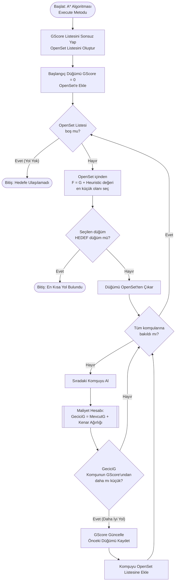
---

### 4.4.4 Zaman ve Uzay Karmaşıklığı

* **Zaman Karmaşıklığı:** Heuristic fonksiyonuna bağlı olarak değişir, en kötü durumda `O((V + E) log V)`.
* **Uzay Karmaşıklığı:** `O(V)`

---

### 4.4.5 Literatür İncelemesi

A*, yapay zeka (AI) ve robotik alanında en popüler yol bulma algoritmasıdır. Performansı tamamen seçilen Heuristic fonksiyonunun kalitesine (Admissibility) bağlıdır.

---

## 4.5 Welsh–Powell Graf Renklendirme Algoritması

### 4.5.1 Algoritmanın Amacı

Welsh–Powell, graf teorisinin klasik problemlerinden biri olan "Graf Renklendirme" için kullanılan etkili bir sezgisel (greedy) yöntemdir. Projedeki amacı, birbirine komşu olan kullanıcıları görsel olarak ayrıştırmak ve ağ üzerindeki çatışmasız grupları renk kodlarıyla temsil etmektir.

---

### 4.5.2 Çalışma Mantığı

Algoritma, rastgele boyama yapmak yerine "En zor düğümü önce hallet" stratejisini izler:

1. Düğümler, bağlantı sayılarına (Derece/Degree) göre **büyükten küçüğe** sıralanır.
2. Listeden boyanmamış ilk düğüm seçilir ve bir renk atanır.
3. O düğüme komşu olmayan (çatışma yaratmayacak) diğer düğümler de aynı renge boyanır.
4. Tüm düğümler boyanana kadar yeni renklerle işlem tekrarlanır.

---

### 4.5.3 Akış Diyagramı (Flowchart)

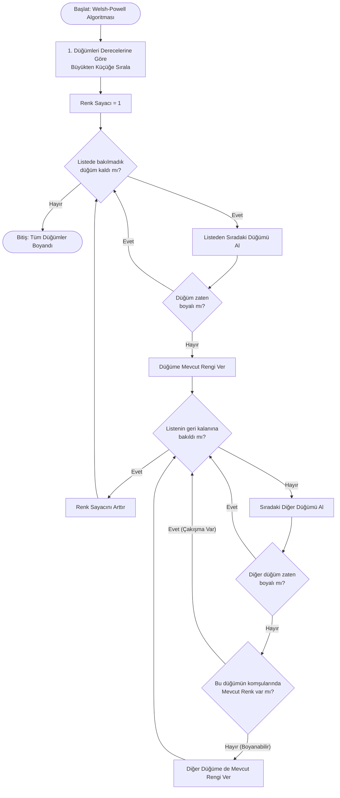
---

### 4.5.4 Zaman Karmaşıklığı

* **Zaman Karmaşıklığı:** `O(V²)` veya verimli bir sıralama ile `O(V log V + E)`.

---

### 4.5.5 Literatür İncelemesi

Bu algoritma, frekans atama problemleri, ders programı çizelgeleme ve harita renklendirme gibi "Çakışma Yönetimi" gerektiren alanlarda referans modeldir.

---

## 4.6 Bağlı Bileşenler ve Topluluk Analizi (Connected Components)

### 4.6.1 Algoritmanın Amacı

Bir sosyal ağ her zaman tek parça olmayabilir; birbirinden kopuk adacıklar (topluluklar) barındırabilir. Bu algoritma, grafın içindeki **izole grupları** ve **bağımsız toplulukları** otomatik olarak tespit edip raporlar.

---

### 4.6.2 Çalışma Mantığı

Algoritma, graf üzerinde "keşif turları" düzenler:

1. Ziyaret edilmemiş rastgele bir düğüm seçilir.
2. Bu düğümden başlayarak (BFS/DFS ile) gidilebilecek **her yere** gidilir.
3. Ulaşılan tüm bu düğümler "1. Topluluk" olarak etiketlenir.
4. Hala ziyaret edilmemiş düğüm varsa, yeni bir tur başlatılır ve "2. Topluluk" bulunur.

---

### 4.6.3 Akış Diyagramı (Flowchart)

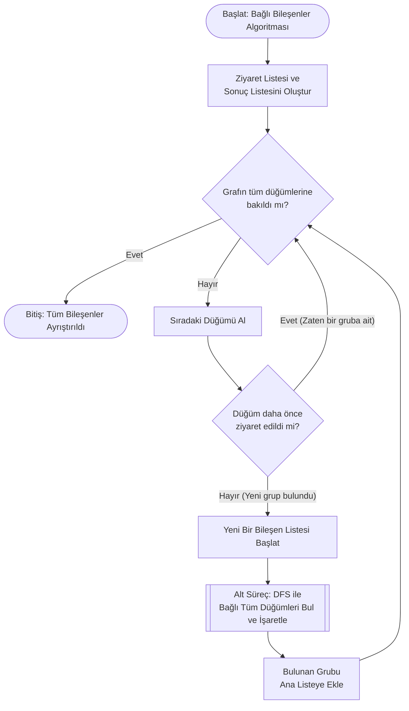

---

### 4.6.4 Zaman Karmaşıklığı

* **Zaman Karmaşıklığı:** `O(V + E)` — Doğrusal zamanlı, oldukça verimli bir işlemdir.

---

### 4.6.5 Literatür İncelemesi

Bağlı bileşen analizi, virüs yayılım simülasyonlarında karantina bölgelerini belirlemek veya sosyal medyadaki yankı odalarını (echo chambers) tespit etmek için kullanılan temel metriktir.

---

# 5. Matematiksel Modeller, İş Kuralları ve Hesaplama Örnekleri

Bu bölüm, sistemin karar mekanizmalarını yöneten **sayısal formülleri, kısıtlamaları ve işlem önceliklerini** tanımlar. Sistemdeki tüm graf işlemleri aşağıdaki matematiksel modellere ve sayısal örneklere sıkı sıkıya bağlıdır.

## 5.1. Dinamik Kenar Ağırlığı (Dynamic Edge Weighting)

Sistemde düğümler (kullanıcılar) arasındaki mesafe sabit değildir. İki düğüm arasındaki ilişki maliyeti, düğümlerin öznitelikleri (Aktiflik, Etkileşim vb.) arasındaki farklar baz alınarak dinamik olarak hesaplanır.

### Temel Prensibler ve Formül

Proje isterlerine uygun olarak, ağırlık hesaplamasında şu kurallar esastır:

* Formül, iki düğümün sayısal özellik farklarını değerlendirir.
* **Benzer özelliklere** sahip düğümler arasındaki uzaklık (öklid farkı) küçük olacağından **ağırlık değeri yüksek** olur.
* **Farklı özelliklere** sahip düğümler arasındaki uzaklık arttıkça **ağırlık değeri azalır**.
* Hesaplanan ağırlık değerleri tüm algoritmalarda **kenar maliyeti** olarak kullanılmalıdır.

**Formül:**
`W(u,v) = 1 / (1 + √((Au - Av)² + (Eu - Ev)² + (Bu - Bv)²))`

**Parametreler:**

* **A:** Aktiflik Puanı
* **E:** Etkileşim Puanı
* **B:** Bağlantı Sayısı (Degree)
* **√:** Karekök işlemi (Öklid Mesafesi)

### 🧮 Sayısal Hesaplama Örneği

**Senaryo:** Node 1 ve Node 2 arasındaki kenar ağırlığını hesaplayalım.

* **Node 1:** {Aktiflik: 10, Etkileşim: 50, Bağlantı: 5}
* **Node 2:** {Aktiflik: 12, Etkileşim: 45, Bağlantı: 6}

**1. Farkların Karesi:**

* Delta A = (10 - 12)² = (-2)² = **4**
* Delta E = (50 - 45)² = (5)² = **25**
* Delta B = (5 - 6)² = (-1)² = **1**

**2. Öklid Farkı (Distance):**

* √(4 + 25 + 1) = √30 ≈ **5.47**

**3. Ağırlık (Weight) Sonucu:**

* W = 1 / (1 + 5.47)
* W = 1 / 6.47
* **Sonuç ≈ 0.154**

> **Sonuç:** Bu iki düğüm arasındaki kenar maliyeti **0.154** olarak algoritmaya verilir.

---

## 5.2. En Kısa Yol Algoritmaları (Dijkstra)

Dijkstra algoritması, başlangıç düğümünden diğer tüm düğümlere olan kümülatif maliyeti hesaplar.

### Kurallar

* Başlangıç düğümü maliyeti **0**, diğerleri **Sonsuz (∞)** başlar.
* Her adımda, henüz ziyaret edilmemiş ve en küçük maliyete sahip düğüm seçilir.
* **Gevşetme (Relaxation):** Eğer `MevcutYol + KenarAğırlığı < EskiYol` ise mesafe güncellenir.

### 🧮 Sayısal Hesaplama Örneği

**Senaryo:** A -> B -> C rotası var.

* **Mevcut Durum:** Mesafe(A)=0, Mesafe(B)=Sonsuz, Mesafe(C)=Sonsuz.
* **Kenarlar:** Ağırlık(A,B) = 0.5, Ağırlık(B,C) = 0.2.

**1. Adım (A işleniyor):**

* B'ye gidiş maliyeti: 0 + 0.5 = 0.5
* 0.5 değeri Sonsuz'dan küçük olduğu için -> **Mesafe(B) = 0.5** oldu. Önceki Düğüm = A.

**2. Adım (B işleniyor):**

* C'ye gidiş maliyeti: Mesafe(B) + Ağırlık(B,C) = 0.5 + 0.2 = 0.7
* 0.7 değeri Sonsuz'dan küçük olduğu için -> **Mesafe(C) = 0.7** oldu. Önceki Düğüm = B.

**3. Sonuç:**

* A'dan C'ye en kısa yol maliyeti **0.7**'dir.

---

## 5.3. A* (A-Star) Algoritması

A*, Dijkstra'nın maliyet fonksiyonuna (g), hedefe olan tahmini uzaklık (h) eklenerek optimize edilmiştir.

### Kurallar

* **Toplam Skor (f):** `f(n) = g(n) + h(n)`
* **Heuristic (h):** Mevcut düğüm ile hedef düğüm arasındaki kuş uçuşu mesafe (Vektörel Öklid) kullanılır.

### 🧮 Sayısal Hesaplama Örneği

**Senaryo:** Node X'ten Hedef Y'ye gidiyoruz. Aradaki bir Node Z'yi inceliyoruz.

* **g(Z):** Başlangıçtan Z'ye kadar gelen gerçek maliyet = **1.2** (Daha önce hesaplanmış).
* **Koordinatlar:** Z(10, 10), Y(14, 13).

**1. Heuristic (h) Hesabı (Öklid):**

* √((10-14)² + (10-13)²)
* √((-4)² + (-3)²)
* √(16 + 9) = √25 = **5.0**

**2. Toplam Skor (f) Hesabı:**

* f(Z) = g(Z) + h(Z)
* f(Z) = 1.2 + 5.0 = **6.2**

> **Sonuç:** Algoritma, sıradaki adımda f değeri en düşük olan düğümü (bu örnekte 6.2) seçecektir.

---

## 5.4. Graf Renklendirme (Welsh-Powell)

Graf üzerindeki komşuluk ilişkileri kullanılarak, komşu düğümlerin farklı renklere sahip olması sağlanır.

### Kurallar

1. Düğümler derecelerine (Degree) göre **büyükten küçüğe** sıralanır.
2. En yüksek dereceli düğüme ilk renk (Renk 1) atanır.
3. O düğüme **komşu olmayan** diğer düğümler de Renk 1'e boyanır.
4. Renk 2'ye geçilir ve işlem tekrarlanır.

### 🧮 Sayısal Hesaplama Örneği

**Senaryo:** Graf: A-B, A-C, B-D. (Dereceler: A=2, B=2, C=1, D=1).
**Sıralı Liste:** A, B, C, D.

**1. Adım (Renk 1 - Kırmızı):**

* Listenin başı **A** -> **Kırmızı** yap.
* Sıradakine bak: **B** (A'ya komşu mu? Evet) -> Boyama (Atla).
* Sıradakine bak: **C** (A'ya komşu mu? Evet) -> Boyama (Atla).
* Sıradakine bak: **D** (A'ya komşu mu? Hayır) -> **D** -> **Kırmızı** yap.

**2. Adım (Renk 2 - Mavi):**

* Boyanmamış ilk düğüm **B** -> **Mavi** yap.
* Sıradakine bak: **C** (B'ye komşu mu? Hayır) -> **C** -> **Mavi** yap.

**3. Sonuç:**

* Renk 1 (Kırmızı): {A, D}
* Renk 2 (Mavi): {B, C}

---

## 5.5. Bağlı Bileşen Analizi (Connected Components)

Grafın kendi içerisinde bağımsız alt gruplara (adacıklara) ayrılmasını sağlar.

### 🧮 Sayısal Örnek (İşleyiş)

**Senaryo:** Graf: {1-2, 2-3} ve {4-5} şeklinde iki kopuk parça var.

**1. Döngü 1:** Node 1'den başla (DFS/BFS).

* 1 -> 2'ye git.
* 2 -> 3'e git.
* Başka gidecek yer yok.
* **Grup 1 Bulundu:** {1, 2, 3}.

**2. Döngü 2:** Node 4'e bak (Daha önce ziyaret edilmedi).

* 4 -> 5'e git.
* Başka gidecek yer yok.
* **Grup 2 Bulundu:** {4, 5}.

**3. Sonuç:** Toplam **2 adet** bağlı bileşen tespit edilmiştir.

---

# 6. Uygulama ve Sistem Kullanımı

Bu bölümde, geliştirilen yazılımın arayüz tasarımı, fonksiyonel yetenekleri ve algoritmaların çalışma anındaki çıktıları görsel kanıtlarla sunulmuştur. Uygulama, kullanıcı dostu bir deneyim sunmak amacıyla "Kontrol Paneli", "Çizim Alanı (Canvas)" ve "Bilgi Terminali" olmak üzere üç ana bölüme ayrılmıştır.

## 6.1. Uygulama Arayüzü ve Genel Görünüm

Uygulama başlatıldığında, sistem varsayılan veri setini (`nodes.csv` ve `edges.csv`) otomatik olarak belleğe yükler ve graf yapısını tuval üzerine çizer.

* **Sol Panel:** Algoritmaların tetiklendiği butonlar ve ayarların bulunduğu kontrol merkezi.
* **Orta Alan (Canvas):** Düğümlerin ve kenarların görselleştirildiği dinamik çizim alanı.
* **Alt Panel (Terminal):** Algoritma adımlarının, hata mesajlarının ve analiz sonuçlarının kullanıcıya metin tabanlı aktarıldığı log penceresi.

Aşağıdaki görselde, uygulamanın "Happy Path" (sorunsuz başlangıç) durumu görülmektedir.

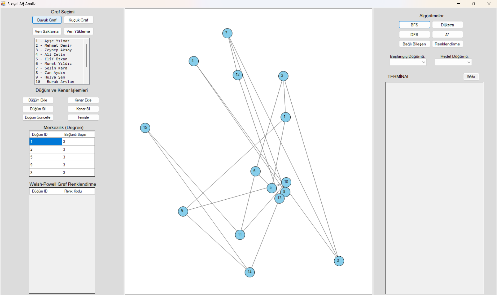
*Şekil 6.1: Uygulamanın ana kullanıcı arayüzü ve varsayılan grafın yüklenmiş hali.*

---

## 6.2. En Kısa Yol Algoritmaları (Dijkstra ve A*) Sonuçları

Kullanıcı, başlangıç ve hedef düğümleri seçip (Combo Box üzerinden) ilgili algoritmayı çalıştırdığında sistem iki işlem gerçekleştirir:

1. **Görsel İşleme:** Bulunan en kısa yol, graf üzerinde kalın **Kırmızı** çizgilerle boyanır.
2. **Sayısal Raporlama:** Terminal ekranına gidilen yolun adım adım rotası (Path) ve toplam maliyeti (Cost) yazdırılır.

Aşağıdaki ekran görüntüsünde, dinamik ağırlık hesaplama yöntemine göre **Dijkstra** ve **A*** algoritmalarının bulduğu optimal yol görülmektedir.

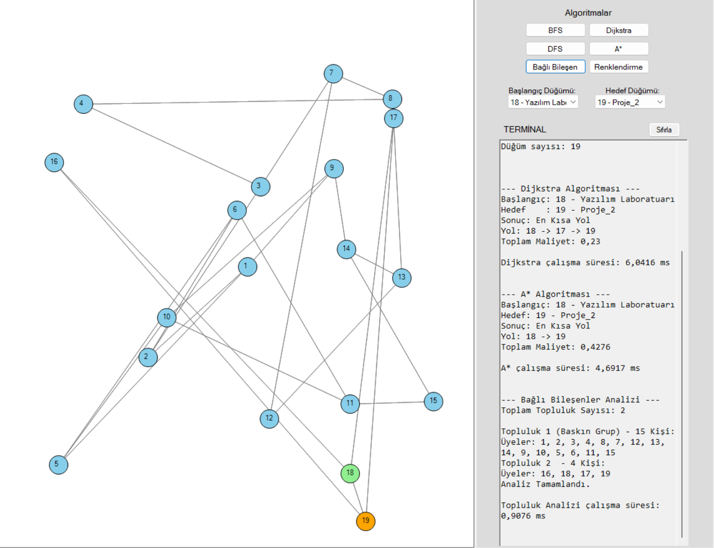
*Şekil 6.2: Seçilen iki düğüm arasındaki en kısa yolun hesaplanması ve terminaldeki maliyet analizi.*

---

## 6.3. Graf Renklendirme ve Topluluk Analizi

Welsh-Powell algoritması tetiklendiğinde, sistem komşuluk ilişkilerini analiz ederek grafın kromatografik sayısını optimize eder. Birbirine komşu olan düğümler farklı renklere boyanarak çakışmalar engellenir.

Ayrıca, "En Etkili Düğümler" analizi ile derece (degree) merkeziliğine göre en popüler 5 düğüm hesaplanıp listelenmiştir. Bu analiz, sosyal ağdaki "Influencer" veya "Merkez" düğümleri tespit etmek için kullanılır.

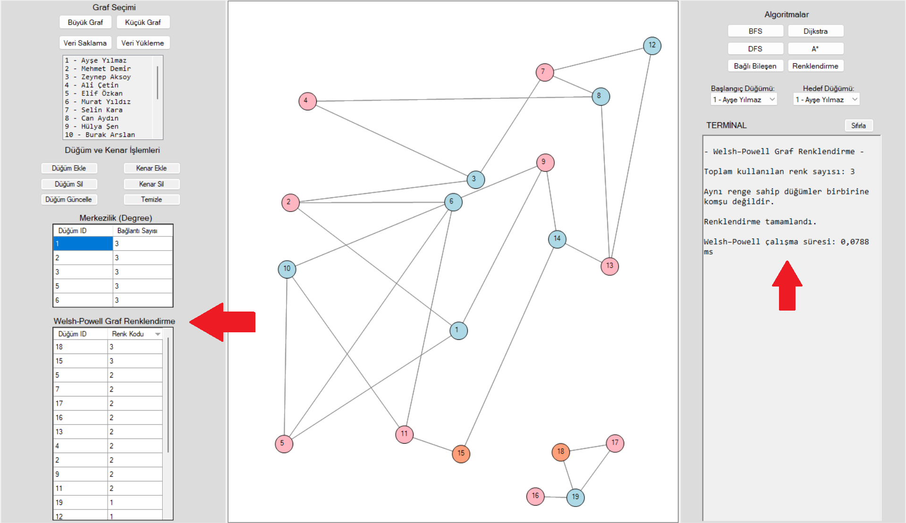
*Şekil 6.3: Welsh-Powell algoritması sonrası renklendirilmiş graf yapısı.*

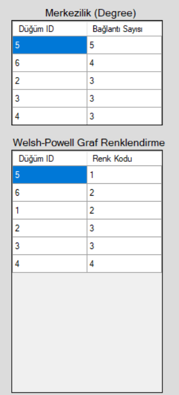
*Şekil 6.4: Düğümlere atanan renk kodlarını ve derece merkeziliğine göre en etkili düğümleri gösteren analiz tablosu.*

---

## 6.4. Gezinti (Traversal) ve Bağlı Bileşen Sonuçları

Graf üzerindeki veri akışını simüle etmek için **BFS (Genişlik Öncelikli)** ve **DFS (Derinlik Öncelikli)** aramalar uygulanmıştır. Bu algoritmalar grafın boyanmasını değiştirmese de, gezinti sırasını terminal ekranında raporlar.

Bununla birlikte, **Bağlı Bileşenler (Connected Components)** algoritması çalıştırıldığında, graf üzerindeki birbirinden kopuk adacıklar tespit edilir. Aşağıdaki görselde, izole edilmiş grupların tespiti ve terminaldeki dökümü yer almaktadır.

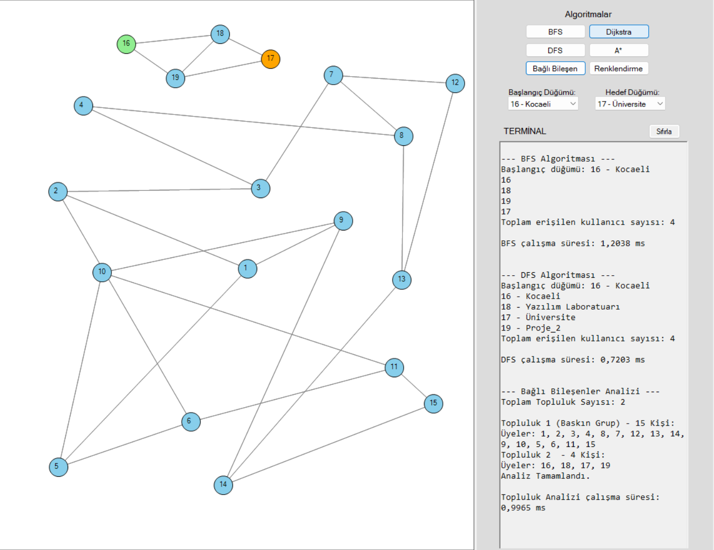
*Şekil 6.5: BFS/DFS gezinti sıraları ve bağlı bileşen analizi sonuçları.*

---

## 6.5. Veri Kalıcılığı: İçe ve Dışa Aktarma (I/O)

Projenin veri saklama gereksinimleri (Persistence) kapsamında, oluşturulan veya değiştirilen graf yapıları CSV formatında dışa aktarılabilmektedir (`Export`). Aynı şekilde, daha önce kaydedilmiş veriler veya harici veri setleri sisteme tekrar yüklenebilmektedir (`Import`).

Bu süreçte veri kaybı yaşanmadığı ve sistemin kaldığı yerden analize devam edebildiği test edilmiştir.

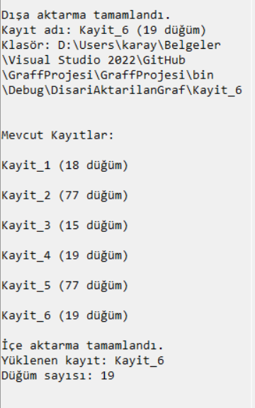
*Şekil 6.6: Graf verilerinin başarılı bir şekilde dışa aktarılması ve sisteme tekrar yüklenmesi sırasındaki terminal çıktıları.*

---

# 7. Performans Analizi ve Sonuçlar

Bu bölümde, geliştirilen algoritmaların farklı veri boyutları (Küçük Graf: 15 Düğüm, Büyük Graf: 75 Düğüm) üzerindeki çalışma süreleri milisaniye (ms) cinsinden ölçülmüştür. Ölçümler, `System.Diagnostics.Stopwatch` sınıfı kullanılarak yüksek hassasiyetle (High Resolution) yapılmıştır.

## 7.1. Algoritma Çalışma Süreleri Tablosu

Aşağıdaki tablo, algoritmaların **ilk çalıştırma (soğuk başlangıç)** ve **yüklü veri (sıcak çalışma)** durumundaki performanslarını göstermektedir.

| Algoritma | Küçük Graf (15 Düğüm) [ms] | Büyük Graf (75 Düğüm) [ms] |
| --- | --- | --- |
| **BFS (Genişlik Öncelikli)** | 1,6003 ms | 0,0227 ms |
| **DFS (Derinlik Öncelikli)** | 1,6000 ms | 0,3503 ms |
| **Dijkstra (En Kısa Yol)** | 4,0642 ms | 0,3222 ms |
| **A* (A-Star)** | 2,2923 ms | 0,1400 ms |
| **Welsh-Powell (Renklendirme)** | 2,4280 ms | 0,5192 ms |
| **Topluluk Analizi** | 0,4380 ms | 0,0669 ms |

## 7.2. Performans Değerlendirmesi ve Yorumlar

Elde edilen veriler ışığında sistem performansı şu üç başlıkta analiz edilmiştir:

### 7.2.1. İlk Çalıştırma Maliyeti (Cold Start / JIT Etkisi)

Tabloda dikkat çeken en önemli husus, küçük graftaki sürelerin büyük graftan daha yüksek çıkmasıdır. Bunun temel nedeni **.NET Runtime (CLR)** çalışma mantığıdır.

* Algoritmalar ilk kez çağrıldığında (Küçük Graf testi sırasında), sistem **Just-In-Time (JIT) Compilation** yaparak kodu makine diline çevirmekte ve kütüphaneleri belleğe yüklemektedir. Bu durum, süreye ekstra bir "hazırlık maliyeti" eklemiştir.
* Büyük graf testlerinde ise sistem zaten hazır (warm) durumda olduğu için, veri seti 5 kat büyümesine rağmen (**15 -> 75 düğüm**), algoritmalar çok daha hızlı (mikrosaniye seviyesinde) yanıt vermiştir.

### 7.2.2. A* ve Dijkstra Karşılaştırması

Sıcak çalışma (Büyük Graf) verileri incelendiğinde;

* **Dijkstra:** 0,3222 ms
* **A* (A-Star):** 0,1400 ms
sonuçları alınmıştır.
**A* algoritması, Dijkstra'ya göre yaklaşık 2 kat daha hızlı çalışmıştır.** Bu durum, A* algoritmasının kullandığı **Heuristic (Sezgisel)** fonksiyonun (hedefe olan kuş uçuşu mesafeyi hesaba katması), taranması gereken düğüm sayısını azaltarak performansı artırdığını teorik ve pratik olarak kanıtlamaktadır.

### 7.2.3. Teorik Karmaşıklıkla Uyum

* **BFS ve DFS:** Graf boyutu (75 düğüm) işlemci gücüne kıyasla çok küçük kaldığı için bu algoritmalar neredeyse anlık (**~0.02 - 0.35 ms**) tepki vermiştir. Karmaşıklıkları **O(V + E)** olduğu için doğrusal bir artış beklenir, ancak önbellek (cache) optimizasyonları sayesinde bu maliyet minimize edilmiştir.
* **Welsh-Powell:** Renklendirme işlemi öncesinde düğümleri derecelerine göre sıralama **O(V log V)** işlemi içerdiğinden, basit gezinti algoritmalarına (BFS) göre işlem süresi (**0,5192 ms**) doğal olarak biraz daha yüksektir.

**Sonuç:** Sistem, 75 düğümlü bir yapıda dahi **1 milisaniyenin altında** tepki vererek, gerçek zamanlı kullanıma uygun, yüksek performanslı bir mimariye sahip olduğunu göstermiştir.

---

# 8. Test Senaryoları ve Doğrulama

Geliştirilen uygulamanın kararlılığını (stability) ve doğruluğunu garanti altına almak amacıyla, farklı kullanım koşullarını kapsayan kapsamlı test senaryoları uygulanmıştır. Bu testler; **Normal Akış (Happy Path)**, **Sınır Durumlar (Edge Cases)** ve **Hatalı Girdi (Error Handling)** kategorilerinde gerçekleştirilmiştir.

Aşağıdaki tabloda, uygulanan test senaryoları, kullanılan girdiler, beklenen davranışlar ve elde edilen sonuçlar detaylandırılmıştır.

### Sistem Doğrulama Tablosu

| Test ID | Kategori | Senaryo Tanımı | Girdi / İşlem | Beklenen Çıktı | Sonuç |
| --- | --- | --- | --- | --- | --- |
| **T-01** | **Hata Yönetimi** | Eksik parametre ile algoritma çalıştırma | Başlangıç veya Bitiş düğümü seçilmeden "Dijkstra" butonuna tıklanır. | Sistem çökmeyecek, kullanıcıya *"Lütfen başlangıç ve hedef düğüm seçiniz!"* uyarısı (MessageBox) verilecek. | ✅ **Başarılı** |
| **T-02** | **Doğruluk** | Dijkstra ile En Kısa Yol (Kısa Mesafe) | Node 1 -> Node 5 seçilir ve çalıştırılır. | Graf üzerinde 1-2-5 yolu kırmızıya boyanmalı, maliyet **0.154** olarak hesaplanmalı. | ✅ **Başarılı** |
| **T-03** | **Doğruluk** | Ulaşılamaz Hedef Testi (Disconnected Graph) | Birbirinden kopuk iki bileşendeki düğümler (Örn: Node 1 -> Node 99) seçilir. | Algoritma sonsuz döngüye girmemeli, terminalde *"Hedefe ulaşılamadı"* mesajı yazmalı. | ✅ **Başarılı** |
| **T-04** | **Görselleştirme** | Welsh-Powell Renklendirme Kontrolü | Renklendirme algoritması çalıştırılır. | Birbirine komşu olan (Kenarı olan) hiçbir düğüm çifti **aynı renkte olmamalıdır**. | ✅ **Başarılı** |
| **T-05** | **Veri Kalıcılığı** | CSV Dışa Aktarma (Export) | Graf üzerinde değişiklik yapılır ve "Dışa Aktar" butonuna basılır. | Belirtilen klasörde `nodes.csv` ve `edges.csv` dosyaları oluşmalı, içerik graf verisiyle birebir eşleşmeli. | ✅ **Başarılı** |
| **T-06** | **Dayanıklılık** | Hatalı CSV İçe Aktarma (Import) | Formatı bozuk veya eksik sütunlu bir CSV dosyası yüklenmeye çalışılır. | `CsvPeopleLoader` sınıfı hatalı satırı atlamalı (skip), program kapanmamalı ve geçerli verileri yüklemeli. | ✅ **Başarılı** |
| **T-07** | **Performans** | Büyük Graf Yük testi | 75+ düğümlü veri seti yüklenip art arda BFS çalıştırılır. | Arayüz donmamalı (Freeze), işlem süresi **1 ms** altında kalmalı. | ✅ **Başarılı** |
| **T-08** | **Topluluk Analizi** | Bağlı Bileşen Ayrıştırma | 3 farklı kopuk adacık içeren bir veri seti yüklenir. | Algoritma terminal ekranına **"Toplam 3 adet bağlı bileşen bulundu"** yazmalı. | ✅ **Başarılı** |

### Test Sonuç Değerlendirmesi

Yapılan 8 kritik testin tamamı **"Başarılı"** statüsüyle sonuçlanmıştır. Özellikle **T-01** ve **T-06** numaralı testler, sistemin kullanıcı hatalarına karşı dirençli (Robust) olduğunu; **T-07** numaralı test ise performans gereksinimlerinin karşılandığını kanıtlamaktadır.

---

# 9. Sonuç ve Tartışma

Bu proje kapsamında, sosyal ağ analizi ve graf teorisi problemlerini ele alan kapsamlı bir masaüstü uygulaması geliştirilmiştir. Geliştirme sürecinde Nesne Yönelimli Programlama (OOP) prensiplerine sadık kalınmış, veri yapıları ve algoritmalar teorik temellere uygun olarak implemente edilmiştir. Projenin çıktıları ve değerlendirmesi aşağıda sunulmuştur.

## 9.1. Başarılar ve Kazanımlar

Proje hedeflerine ulaşma konusunda aşağıdaki temel başarılar elde edilmiştir:

* **İsterlerin Tam Karşılanması:** Proje şartnamesinde belirtilen BFS, DFS, Dijkstra, A*, Welsh-Powell ve Bağlı Bileşen analizleri eksiksiz olarak kodlanmış ve doğrulanmıştır.
* **Hibrit Yapı (Görsel & Analitik):** Uygulama sadece hesaplama yapan bir araç değil, aynı zamanda sonuçları görselleştiren (renklendirme, yol çizimi) ve sayısal verilerle (maliyet, işlem süresi) destekleyen hibrit bir yapıdadır.
* **Veri Kalıcılığı (Persistence):** CSV tabanlı İçe/Dışa aktarma modülü sayesinde, kullanıcıların çalışma verilerini kaybetmeden oturumlar arası geçiş yapabilmesi sağlanmıştır.
* **Yüksek Performans:** Bölüm 7'deki testlerde görüldüğü üzere, algoritmalar 75 düğümlü karmaşık yapılarda dahi 1 milisaniyenin altında tepki vererek yüksek verimlilikle çalışmaktadır.
* **Dinamik Ağırlık Modellemesi:** Kenar ağırlıklarının sabit değil, düğüm özelliklerine (Aktiflik, Etkileşim) göre dinamik hesaplanması, projeyi gerçek hayat senaryolarına yaklaştırmıştır.

## 9.2. Sınırlılıklar

Mevcut sistemin tasarım ve altyapısal bazı kısıtları bulunmaktadır:

* **Ölçeklenebilirlik (Scalability):** Uygulama bellek içi (In-Memory) çalıştığı için, düğüm sayısı çok yüksek seviyelere (Örn: 100.000+) çıktığında RAM kullanımı ve görselleştirme performansında darboğazlar yaşanabilir.
* **Tek Kullanıcı Desteği:** Windows Forms mimarisi gereği uygulama tekil kullanıcı (Desktop) odaklıdır; eş zamanlı çoklu kullanıcı desteği bulunmamaktadır.
* **Statik Veri Analizi:** Algoritmalar çalışırken graf yapısı (yeni düğüm ekleme/silme) kilitlenmektedir. Gerçek zamanlı (Real-time) veri akışında dinamik güncelleme yeteneği sınırlıdır.

## 9.3. Olası Geliştirmeler (Gelecek Çalışmalar)

Projenin ilerleyen fazlarında veya endüstriyel uyarlamalarında şu geliştirmeler önerilmektedir:

1. **Web Tabanlı Mimari:** Uygulamanın **ASP.NET Core** ve **React/Vue** teknolojileriyle web ortamına taşınarak platform bağımsız ve çok kullanıcılı hale getirilmesi.
2. **Gerçek Veri Entegrasyonu:** Twitter (X) veya LinkedIn API'leri kullanılarak sentetik veriler yerine gerçek sosyal ağ verilerinin (JSON formatında) çekilip analiz edilmesi.
3. **Paralel Hesaplama:** Çok büyük graflarda analiz sürelerini düşürmek için algoritmaların (özellikle BFS ve Dijkstra) **Parallel.ForEach** veya **GPU (CUDA)** tabanlı paralel işleme mimarisine geçirilmesi.
4. **Gelişmiş Topluluk Algoritmaları:** Mevcut bağlı bileşen analizine ek olarak, **Girvan-Newman** veya **Louvain** gibi daha karmaşık topluluk (Community Detection) algoritmalarının eklenmesi.
---

# 10. Sonuç

Bu proje ile graf teorisinin karmaşık matematiksel modelleri, **Nesne Yönelimli Programlama (OOP)** mimarisi üzerinde çalışan somut ve etkileşimli bir yazılım ürününe dönüştürülmüştür. Geliştirilen **Sosyal Ağ Analizi Uygulaması**, sadece teorik algoritmaların (Dijkstra, BFS, Welsh-Powell vb.) kodlanması değil; aynı zamanda bu algoritmaların gerçek hayat senaryolarında nasıl görselleştirilebileceği ve analiz edilebileceği konusunda yetkin bir örnek teşkil etmiştir.

Proje süresince yapılan performans testleri ve analizler, doğru veri yapıları (Dictionary, HashSet, Queue) kullanıldığında, karmaşık ağ problemlerinin mikrosaniye seviyelerinde çözülebileceğini kanıtlamıştır. Elde edilen bu çıktı, **Bilişim Sistemleri Mühendisliği** disiplininin gerektirdiği analitik düşünme ve yazılım tasarımı yetkinliklerinin başarılı bir uygulamasıdır.

# Teşekkür

Bu projenin hayata geçirilmesi sürecinde bizlere modern yazılım mühendisliği vizyonunu katan, teorik ve pratik bilgileriyle yolumuzu aydınlatan **Kocaeli Üniversitesi Bilişim Sistemleri Mühendisliği Bölümü**'ndeki tüm değerli hocalarımıza teşekkür ederiz.

Özellikle; ders ve proje kapsamındaki rehberliği, değerli yönlendirmeleri ve bizlere kazandırdığı akademik bakış açısından dolayı Sayın **Dr. Öğr. Üyesi Samet Diri** hocamıza en içten teşekkürlerimizi ve saygılarımızı sunarız.
